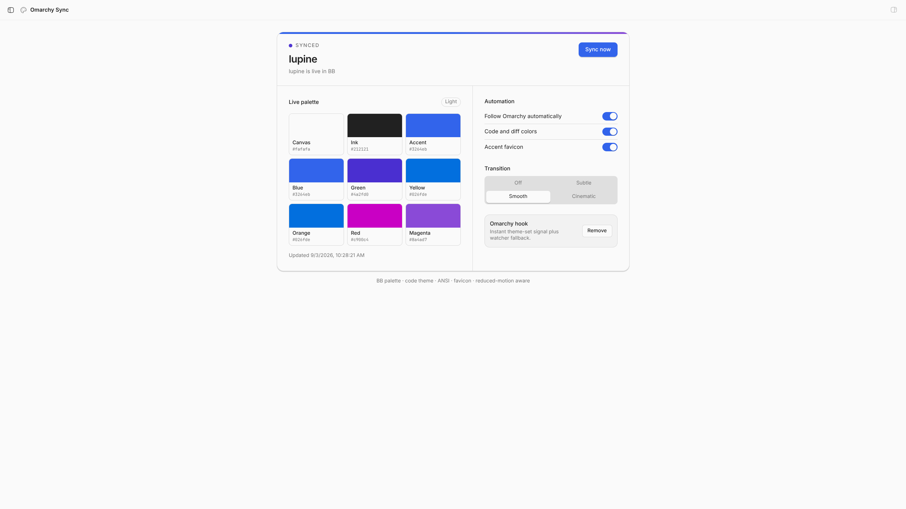
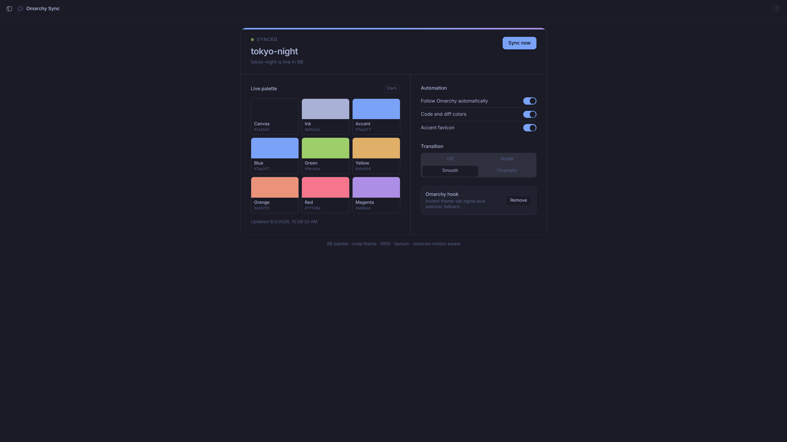

# Omarchy Sync for BB

Keep BB visually in step with the active [Omarchy](https://omarchy.org) theme. Switch an Omarchy theme and BB follows automatically—palette, light/dark mode, terminal ANSI colors, code and diff accents, favicon tint, and a motion-aware transition.

## Showcase

[Watch the 36-second Omascreen showcase](https://github.com/salemsayed/bb-plugin-omarchy/releases/download/v0.1.1/showcase.mp4)

| Lupine · light | Tokyo Night · dark |
| --- | --- |
|  |  |

## What it does

- Reads Omarchy's active `colors.toml` through BB's primary-host daemon.
- Follows `omarchy-theme-set` immediately through an isolated hook, with a native file-watcher fallback.
- Maps Omarchy's semantic and 16 ANSI colors onto BB's current palette model.
- Handles explicit Omarchy `mode = "light"` / `mode = "dark"`, with a luminance fallback for older themes.
- Offers Off, Subtle, Smooth, and Cinematic transitions and honors `prefers-reduced-motion`.
- Includes a BB panel with live swatches, sync status, controls, and hook management.

## Desktop, PWA, and mobile behavior

The BB desktop app, a normal browser tab, and an installed BB PWA follow Omarchy. They are all web surfaces and receive the same client-only overlay.

The native BB mobile app remains independent. Omarchy Sync detects BB's Expo/React Native bridge and does not fetch or inject theme CSS there. It also leaves BB's shared server palette ID unchanged, so the native mobile palette and the phone's own light/dark preference are never overwritten.

## Requirements

- Omarchy with a theme containing `colors.toml`
- BB 0.41 or newer
- Omarchy running on BB's primary host

## Install

Once the marketplace listing is live:

```sh
bb plugin install omarchy
```

Directly from GitHub:

```sh
bb plugin install git:https://github.com/salemsayed/bb-plugin-omarchy.git@^0.1.0
bb plugin run omarchy hook install
```

Open **Omarchy Sync** from BB's navigation panel. The hook is recommended for the fastest switch; the watcher still keeps themes synchronized if the hook is not installed.

## Commands

```sh
bb omarchy status
bb omarchy sync
bb omarchy hook install
bb omarchy hook remove
```

Add `--json` to any command for machine-readable output. The explicit equivalent is `bb plugin run omarchy …`.

## Development

Sync types from the BB version you are developing against, then validate and build:

```sh
bb plugin types .
npm ci
npm run check
bb plugin build .
bb plugin install . --yes
```

Tests cover Omarchy TOML parsing, light/dark inference, color generation, hook ownership, server behavior, and the Expo/PWA client boundary.

## Privacy and safety

The plugin reads only the active Omarchy theme files on the primary host. It makes no outbound requests and sends no theme data to third parties. The optional hook owns exactly `~/.config/omarchy/hooks/theme-set.d/90-bb-omarchy`; removing it does not touch other Omarchy hooks.

## License

MIT
